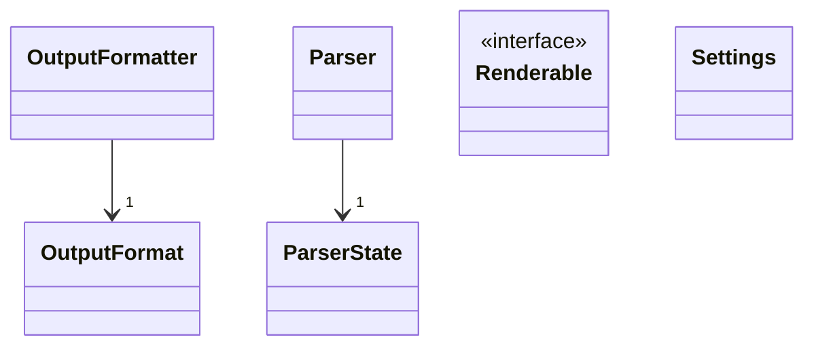

# Mermaid Test

Testing Mermaid in Markdown on GitHub.

```mermaid
classDiagram
    class OutputFormat {
    }
   
    class OutputFormatter {
    }
    
    OutputFormatter --> "1" OutputFormat
    class Parser {
    }
    
    class ParserState {
    }

   Parser --> "1" ParserState
    
    class Renderable {
    }
    <<interface>> Renderable
    
    class Settings {
    }
```
